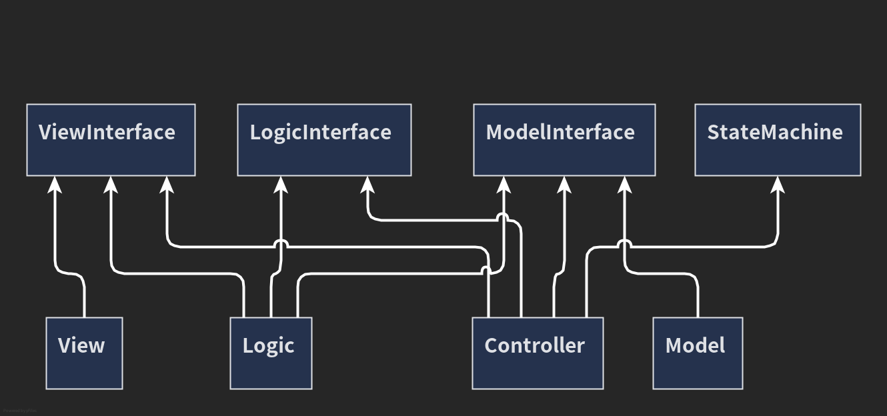

# 1-1 ディレクトリ構造と各レイヤーの責務

ここでは、各プログラムがどのような場所に置かれているかを解説する。

## 前提知識(Assembly Definition)

C#にはアセンブリ定義ファイルというものが存在する。


## プログラム関係図




## ディレクトリ構造図

```
Assets/Scripts
├─ Controller
├─ Installer
├─ Logic
├─ Model
├─ Module
├─ Structure
├─ View
└─ Tests
```
ゲーム用プログラム
```
├─ Global
├─ InGame
│   ├─ Player
│   ├─ Stage
│   └─ UserInterface
└─ OutGame
├─ StageSelect
└─ Title
```

