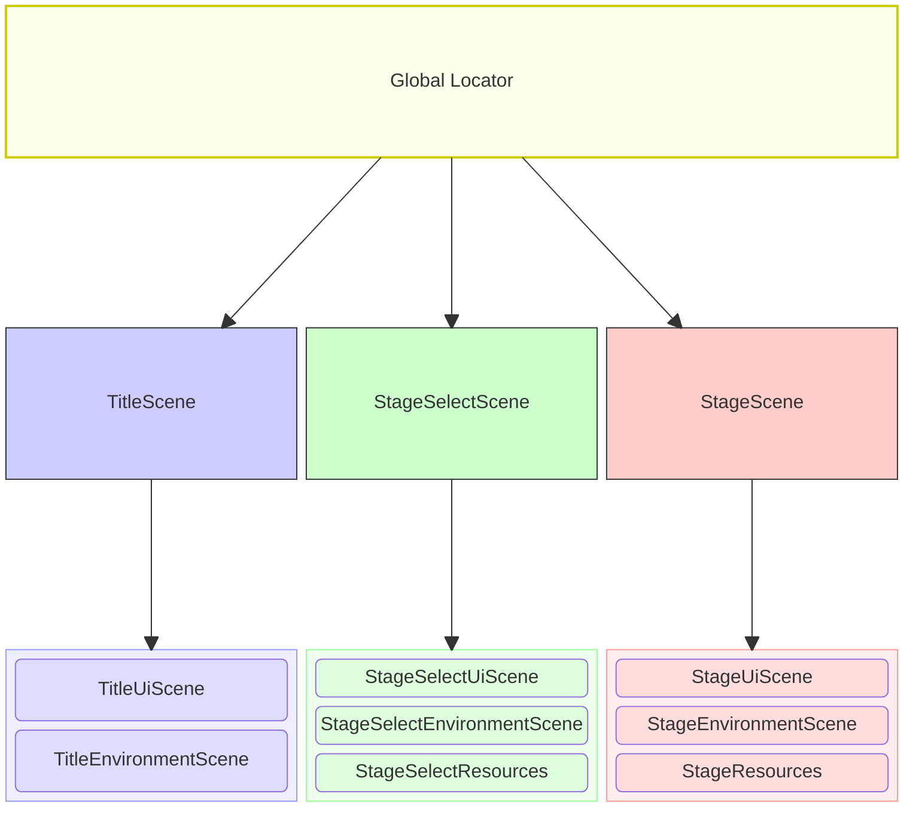

# ドキュメント

## シーンの依存関係

```mermaid

block-beta
    columns 3

%% 上段: グローバルエントリー
    GL["Global Locator"]:3
    space:3

%% 中段: 主要シーン3つを横並び (幅3で均等割)
    TitleScene["TitleScene"]
    StageSelectScene["StageSelectScene"]
    StageScene["StageScene"]
    space:3

%% 下段: サブシーングループ
    block:TitleDeps
        columns 1
        TitleUiScene("TitleUiScene")
        TitleEnvironmentScene("TitleEnvironmentScene")
    end

    block:StageSelectDeps
        columns 1
        StageSelectUiScene("StageSelectUiScene")
        StageSelectEnvironmentScene("StageSelectEnvironmentScene")
        StageSelectResources("StageSelectResources")
    end

    block:StageDeps
        columns 1
        StageUiScene("StageUiScene")
        StageEnvironmentScene("StageEnvironmentScene")
        StageResources("StageResources")
    end

%% 下段の配置（サブグループ3つ横並び）
    TitleDeps StageSelectDeps StageDeps

%% 矢印／依存関係
    GL --> TitleScene
    GL --> StageSelectScene
    GL --> StageScene

    TitleScene --> TitleDeps
    StageSelectScene --> StageSelectDeps
    StageScene --> StageDeps

%% カラー
    style GL fill:#ffe,stroke:#cc0,stroke-width:2px
    style TitleScene fill:#ccf,stroke:#333
    style StageSelectScene fill:#cfc,stroke:#333
    style StageScene fill:#fcc,stroke:#333
    style TitleDeps fill:#eef,stroke:#99f
    style StageSelectDeps fill:#efe,stroke:#9f9
    style StageDeps fill:#fee,stroke:#f99
    style TitleUiScene fill:#ddf
    style TitleEnvironmentScene fill:#ddf
    style StageSelectUiScene fill:#dfd
    style StageSelectEnvironmentScene fill:#dfd
    style StageSelectResources fill:#dfd
    style StageUiScene fill:#fdd
    style StageEnvironmentScene fill:#fdd
    style StageResources fill:#fdd

```

## ライフタイムスコープの依存関係