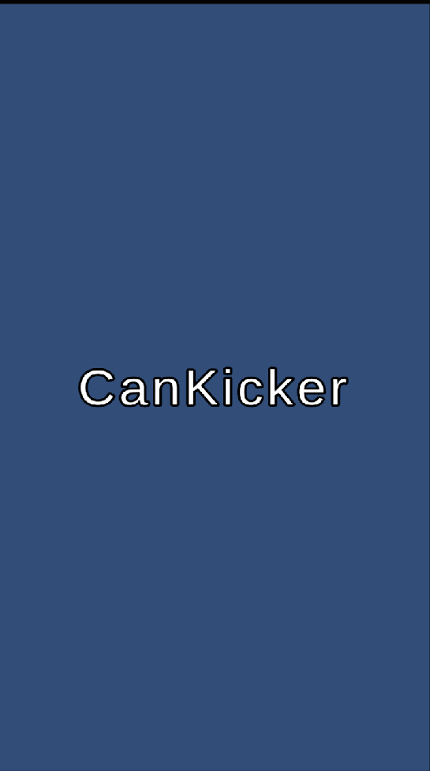
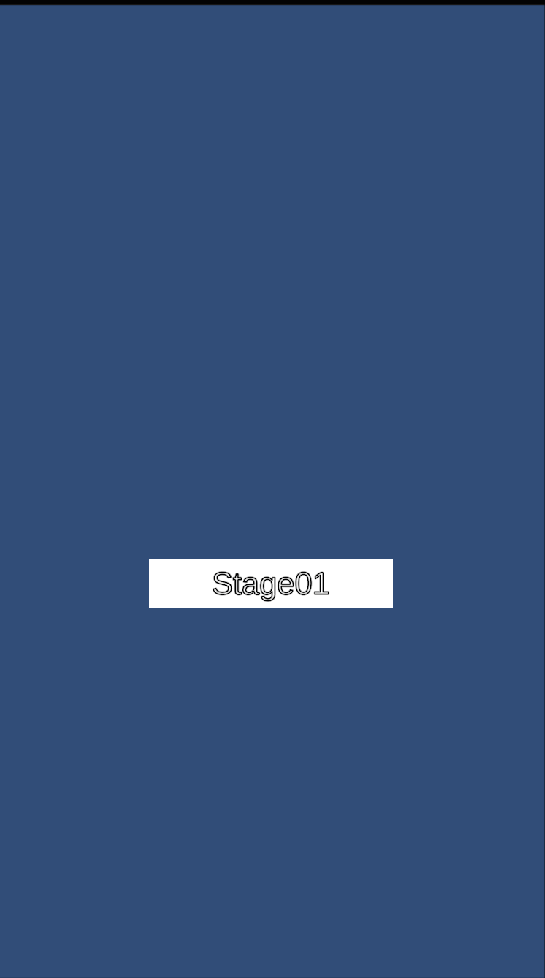
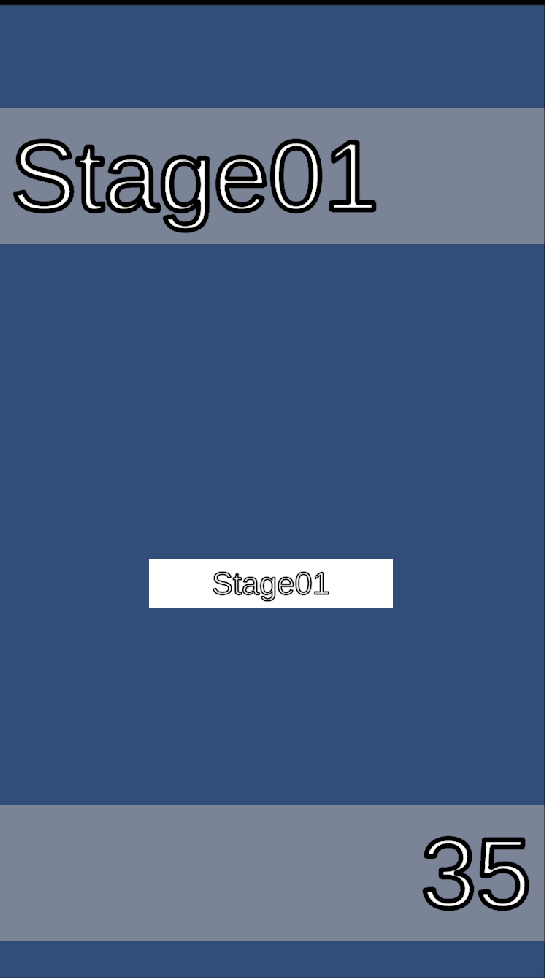
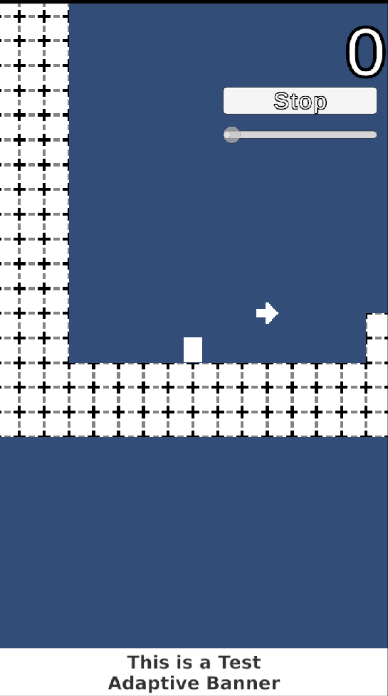

## はじめに

### この記事で解説すること

この記事では、より良いプログラムを実現するための手段として、
デザインパターンやそれの実装を補助するライブラリについて解説を行う。
これらは、ネット上では抽象的な理論として解説が存在するが、
実際にゲームに組み込まれたプログラムとして探すことは難しい。

ここで、私自身学んだことの振り返りとして言語化を行いたいと思った。

### CanKickingの概要

まずは、このゲームの仕様について話そうと思う。

#### タイトル

* タッチでステージセレクトに移動する

#### ステージセレクト

* 上下にスクロール移動を行う
* 選択状態
  * 選択なし
    * ステージをタッチで選択すると、選択状態に移行する
  * 選択状態
    * 選択されているステージ名、最小ジャンプ数が表示される
    * 選択されているステージをもう一度選択するとステージに移動する

#### ステージ

* プレイヤー
  * 待機状態
    * フリックで引っ張り状態に移行する
  * 引っ張り状態
    * 指を離すとプレイヤーが飛ぶ
  * 飛行状態
    * 時間が加速する
    * 着地すると、待機状態に移行する
* ゴールに到達したらクリア
* 一定座標以下に落ちると最初の地点にリスポーンする

### 対象読者

Unityを利用したゲーム開発経験があり、オブジェクト指向の基本的用語がわかること。
